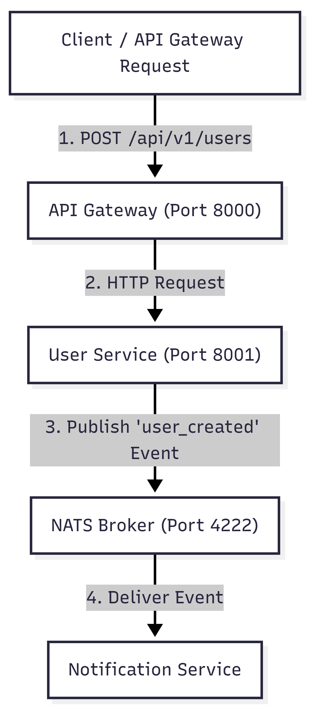

# TRAMS Backend Assignment

## Event-Driven Microservices Architecture with NATS & Node.js

## Project Overview

This project is a backend application built using Node.js and Express.js.
It follows a microservices architecture where different services handle
different responsibilities.

The application consists of an API Gateway, User Service, and Notification
Service. The API Gateway communicates with the User Service through HTTP
requests, while asynchronous communication between services is handled
using the NATS message broker.

When a user is created, the User Service publishes a `user_created` event
to NATS. The Notification Service listens for this event and processes the
required notification operation.

## Technologies Used

- Node.js
- Express.js
- NATS
- Axios
- Docker
- Docker Compose

## System Architecture

<p align="center">
  
</p>

## Project Structure

The project contains the following services:

### API Gateway

The API Gateway acts as the entry point for client requests and runs on
port 8000. It receives the request and forwards it to the User Service
through an HTTP request.

### User Service

The User Service runs on port 8001. It handles user-related operations
and publishes the `user_created` event to the NATS server.

### Notification Service

The Notification Service listens for the `user_created` event from NATS
and handles the notification-related operation.

### NATS

NATS is used as the message broker for asynchronous communication between
the User Service and Notification Service.

## Environment Variables

The required environment variables are configured using a `.env` file.

```env
PORT=8000
NATS_URL=nats://localhost:4222
USER_SERVICE_URL=http://localhost:8001
```

## Installation

Make sure Node.js and Docker are installed on the system.

Install the required dependencies for each service:

```bash
cd notification-service
npm install
```

```bash
cd ../user-service
npm install
```

```bash
cd ../api-gateway
npm install
```

## How to Run the Services

### Option 1: Running Locally Without Docker

Run each service in a separate terminal.

#### Step 1: Start NATS Server

Open a terminal in the project root directory and run:

```powershell
.\nats-server.exe
```

#### Step 2: Start Notification Service

Open a new terminal and run:

```bash
cd notification-service
node index.js
```

#### Step 3: Start User Service

Open a new terminal and run:

```bash
cd user-service
node index.js
```

#### Step 4: Start API Gateway

Open another terminal and run:

```bash
cd api-gateway
node index.js
```

The API Gateway is available on port `8000` and the User Service is
available on port `8001`.

### Option 2: Running with Docker Compose

Make sure Docker Desktop is running.

From the project root directory, run:

```bash
docker-compose up --build
```

To stop the services:

```bash
docker-compose down
```

## API Documentation

### Create User

Creates a new user through the API Gateway and forwards the request
to the User Service.

**URL**

```text
http://localhost:8000/api/v1/users
```

**Method**

```text
POST
```

**Headers**

```text
Content-Type: application/json
```

**Request Body**

```json
{
  "user_id": "101",
  "name": "Sathya",
  "email": "sathya@example.com"
}
```

### Successful Response

**Status: 200 OK**

```json
{
  "status": "Success",
  "message": "User created and event published to NATS!"
}
```

### Validation Error Response

**Status: 400 Bad Request**

```json
{
  "error": "Validation Error",
  "message": "Missing required fields: user_id, name, and email are required."
}
```

### Service Error Response

**Status: 500 Internal Server Error**

```json
{
  "error": "User Service Error"
}
```

